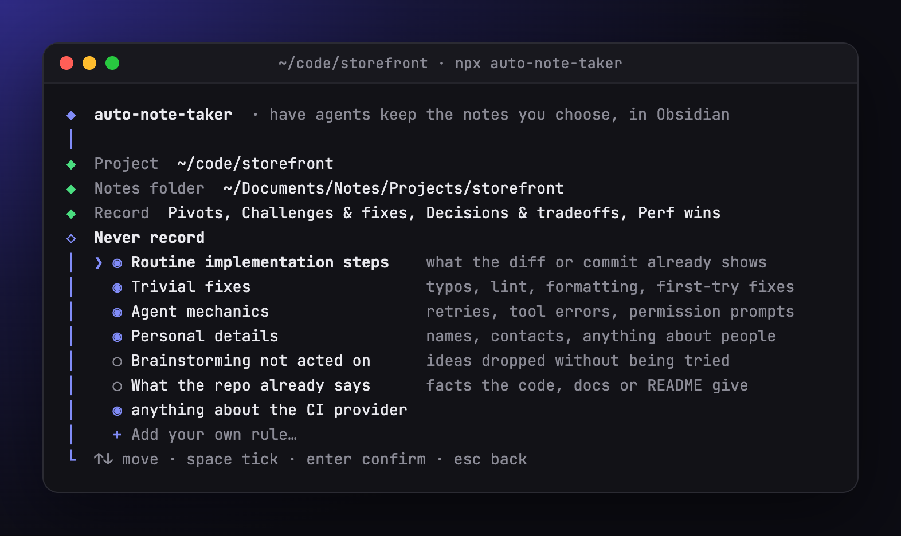
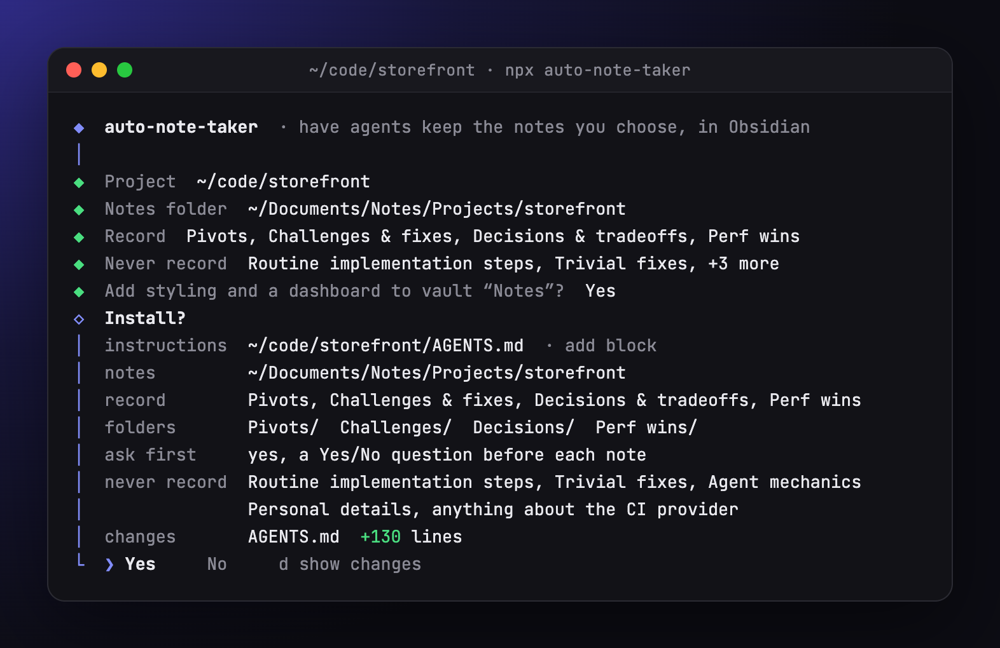
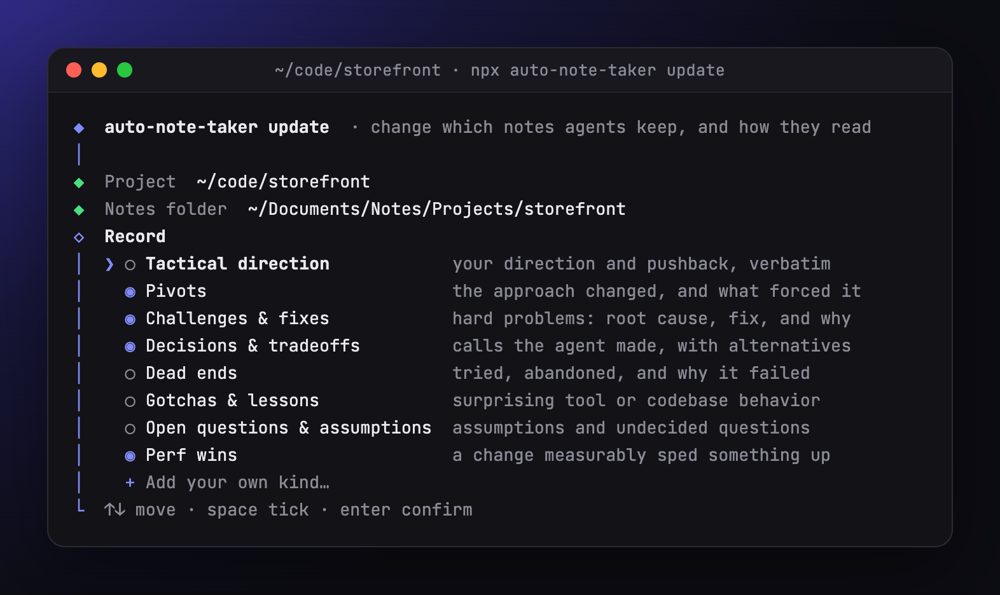
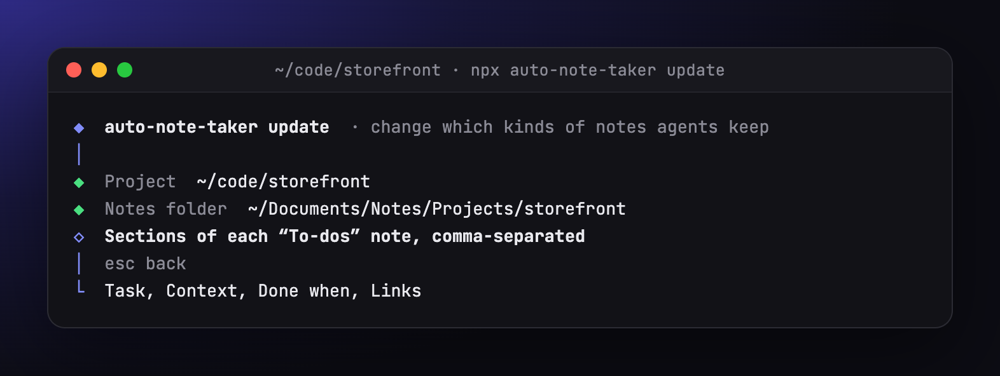
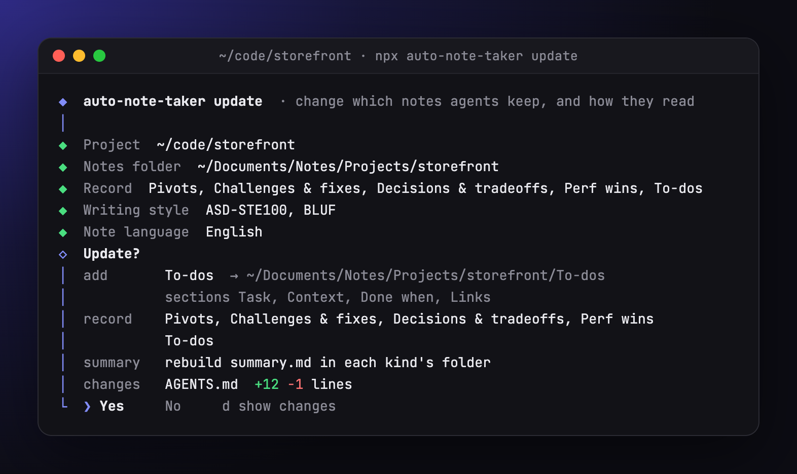
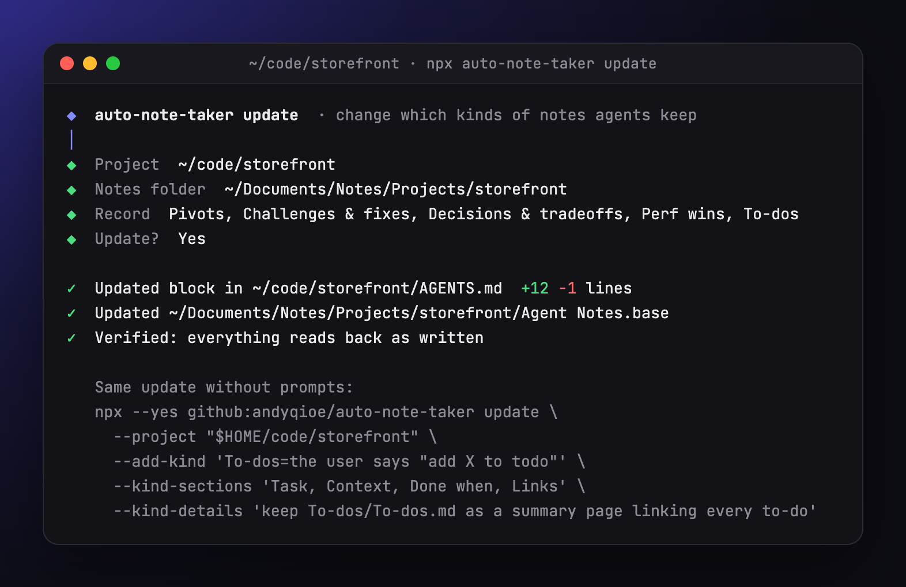
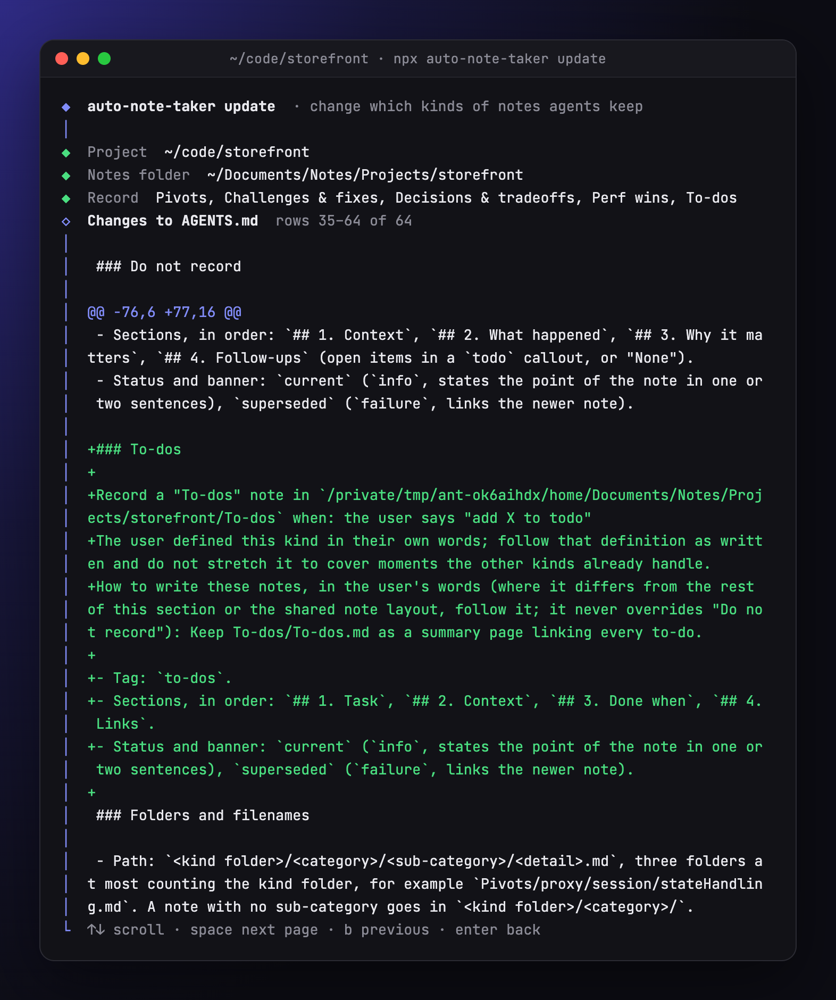

# Auto Note Taker

Your coding agents forget why things are the way they are.
Auto Note Taker fixes that by teaching them to write it down.

It installs a short set of instructions into your project's `AGENTS.md`.
You choose what the agent records, from a menu: pivots, hard problems and how they were solved, the decisions it made on its own, your tactical direction, dead ends, gotchas, open questions, or kinds you define yourself.
You also choose what it must never record, such as routine steps, trivial fixes or anyone's personal details.
From then on, the agent writes each of those moments as an Obsidian note, filed by kind and then by topic: the point first, the reasoning below it, your exact words preserved where they decided something.
Future agents read those notes before acting, so nobody relearns the same lesson twice.


The installer has no dependencies, makes no network or model calls, and only edits one marked block in `AGENTS.md`.
The instructions are a plain prompt, not a skill or plugin, so any agent that reads `AGENTS.md` can follow them.

## Contents

- [How it works](#how-it-works)
- [Requirements](#requirements)
- [Quick start](#quick-start)
- [Install step by step](#install-step-by-step)
- [Install without prompts](#install-without-prompts)
- [Add or remove kinds later](#add-or-remove-kinds-later)
- [Review the diff](#review-the-diff)
- [What agents record](#what-agents-record)
- [What a note looks like](#what-a-note-looks-like)
- [Obsidian styling and dashboard](#obsidian-styling-and-dashboard)
- [Update, check and uninstall](#update-check-and-uninstall)
- [Troubleshooting](#troubleshooting)
- [Development](#development)

## How it works

1. **You run the installer once per project.**
It asks what to record and what to leave out, then adds a block between `<!-- BEGIN tactical-direction-context -->` and `<!-- END tactical-direction-context -->` to the project's `AGENTS.md`.
The block holds the rules for exactly the kinds you chose, and nothing for the ones you did not.
2. **Your agent reads `AGENTS.md` at the start of every session**, as Codex, Cursor and many other coding agents already do (for Claude Code, see [Requirements](#requirements)).
3. **When one of those moments happens, the agent asks you first**, with a Yes/No selector in its UI that names the note's kind, title and path.
It writes or updates the note in that kind's folder only when you answer Yes.
Agents that run unattended can skip the question; see [`--headless`](#install-without-prompts).
When the related work is finished, it links the note to its implementation summary.

Nothing runs in the background.
The installer writes text; the agent does the recording.

## Requirements

- Node.js 18 or newer.
- Git, which `npx` uses to fetch this repository from GitHub.
- An agent that reads `AGENTS.md`.
Claude Code reads `CLAUDE.md` instead: make `AGENTS.md` a symlink to `CLAUDE.md` (`ln -s CLAUDE.md AGENTS.md`) before installing, or add the line `@AGENTS.md` to `CLAUDE.md`.
The installer follows a symlink as long as it stays inside the project.
- Obsidian is optional.
Notes are plain Markdown, but they are designed to look their best in Obsidian 1.9 or newer (the dashboard needs the core Bases plugin).

## Quick start

From the project you want agents to take notes for:

```sh
cd ~/code/storefront
npx --yes github:andyqioe/auto-note-taker
```

Pick the notes folder, tick what to record and what never to record, accept the styling if the folder is in an Obsidian vault, and confirm.
That is the whole setup.

To add or remove kinds later, run `npx --yes github:andyqioe/auto-note-taker update` from the same project (see [Add or remove kinds later](#add-or-remove-kinds-later)).

## Install step by step

### 1. Start the wizard

Run the command above in a terminal.
The wizard starts whenever a terminal is attached and you did not pass both `--project` and `--notes-dir`.

Every screen works the same way:

| Key | Action |
|---|---|
| `↑` `↓` (or `j` `k`) | Move between options |
| `1` to `9` | Jump straight to an option |
| `Space` | Tick or untick, on the two checklists |
| `Enter` | Choose, or confirm a checklist |
| `Esc` | Go back one screen |
| `Ctrl+C` | Quit without changing anything |

### 2. Choose the project

The first screen offers **This folder** (the current directory, with a hint if it already has `AGENTS.md`, `CLAUDE.md` or `.git`), **Browse…**, or **Type a path…**.
The project is where `AGENTS.md` lives.

### 3. Choose the notes folder


| Option | When to use it |
|---|---|
| **Keep current** | Shown when the project already has an install; keeps its folder. |
| **In this project** | Notes go to `./Agent Notes` inside the project and are committed with the code. |
| **Obsidian · *vault name*** | Opens the folder browser at the root of that vault. The wizard lists up to five vaults, most recently opened first, read from Obsidian's own vault list. |
| **Browse…** | Opens the folder browser at the project. |
| **Type a path…** | Type any path. `~` works, relative paths are relative to the project, and `Tab` completes folder names. |

A notes folder inside the project is recorded as a project-relative path, so the instructions keep working if the project moves or is cloned elsewhere.
A folder outside the project is recorded as an absolute path.

### 4. Browse to the folder


The browser shows the current folder at the top, then two actions, then the subfolders.

| Key | Action |
|---|---|
| `↑` `↓` | Move |
| `Enter`, `→` or `Tab` on a folder | Open it |
| `←`, or `Backspace` with an empty filter | Go up to the parent folder |
| Any letters | Filter the subfolders; `Enter` opens the highlighted match |
| `Esc` | Clear the filter, or go back if there is none |
| `Home` / `End` | Jump to the first or last row |

To choose, move to **✓ Use this folder** and press `Enter`.
The cursor always starts on the first subfolder, so pressing `Enter` repeatedly keeps opening folders and never chooses one by accident.

To start a fresh folder, choose **+ New folder here**, type a name (it defaults to `Agent Notes`), and press `Enter`.
The folder is not created now; the agent creates it with the first note.

A folder that contains `.obsidian/` is marked as an Obsidian vault.
Hidden folders, `node_modules` and `__pycache__` are not listed.

### 5. Choose what to record


A checklist of note kinds, one per line with a short hint.
Tick with `Space` and confirm with `Enter`; at least one kind is required.
**Pivots** and **Challenges & fixes** start ticked; on a re-run, the list starts from your last choice.
See [What agents record](#what-agents-record) for what each kind captures.

To record something the list does not cover, choose **+ Add your own kind…**, give it a name ("Perf wins") and finish the sentence "Record it when…" ("a change measurably sped something up").
Then press `Enter` to keep the suggested sections (Context, What happened, Why it matters, Follow-ups) or type your own, comma-separated.
Last, optionally say how agents should write these notes ("give p50 and p95 before and after"); press `Enter` to skip.
It joins the list ticked, gets its own folder named after it, and agents follow your sentence as its definition.

### 6. Choose what never to record



The same kind of checklist, for moments agents must leave out even when they fit a kind you chose.
The first four start ticked:

| Exclusion | Leaves out |
|---|---|
| **Routine implementation steps** | What the diff, the commit message or an implementation summary already records |
| **Trivial fixes** | Typos, lint, formatting, and bugs fixed on the first try |
| **Agent mechanics** | Retries, tool errors, permission prompts, reruns |
| **Personal details** | Names, contact details, anything about people rather than the work (notes say "the reviewer" instead) |
| **Brainstorming not acted on** | Ideas floated and dropped without being tried |
| **What the repo already says** | Facts a reader gets from the code, its docs or its README |

**+ Add your own rule…** adds a line in your words, such as "anything about the CI provider".
Secrets are always redacted, whatever you tick.

### 7. Decide on styling


If the notes folder is inside an Obsidian vault, the wizard offers to add a styling snippet and a dashboard, and lists every file it would add (`+`) or change (`~`).
See [Obsidian styling and dashboard](#obsidian-styling-and-dashboard) for what they do.
Choose **No** to keep the vault untouched; notes still render with stock Obsidian colors.

### 8. Confirm



The last screen shows the instructions file, whether the block will be created, added or updated, the notes folder, the kinds to record with their folders, and what will never be recorded.
The **changes** row sizes the edit to `AGENTS.md` in lines added and removed.
Press `d` to read the exact diff before deciding (see [Review the diff](#review-the-diff)).
Nothing is written before you choose **Yes**.
`Esc` goes back a step at a time, keeping what you ticked.

### 9. Done


The wizard lists every file it wrote, with the lines added and removed in `AGENTS.md`, and prints the same install as a command, with your kinds and exclusions as flags, that you can paste into a script, a README or another machine.
Paths under your home folder print as `"$HOME/…"` so the command works for teammates too.

## Install without prompts

Pass both paths, or add `--yes` to accept defaults for anything missing.
Without `--record` and `--skip`, a project keeps the choice it made last time (a first install uses the defaults).
The installer also never prompts when stdin or stdout is not a terminal (CI, pipes) or with `--check`.

```sh
# Notes inside the project, recording the defaults (pivots and challenges)
npx --yes github:andyqioe/auto-note-taker --project . --yes

# Notes in a vault, with your own choice of kinds and exclusions, plus the styling and dashboard
npx --yes github:andyqioe/auto-note-taker \
  --project ~/code/storefront \
  --notes-dir "$HOME/Documents/Notes/Projects/storefront" \
  --record tactical-direction,pivots,challenges,decisions \
  --add-kind 'Perf wins=a change measurably sped something up' \
  --skip routine,trivial-fixes,agent-mechanics,personal \
  --add-skip 'anything about the CI provider' \
  --obsidian-extras

# Agents that run unattended (CI, scheduled jobs) write notes without asking
npx --yes github:andyqioe/auto-note-taker --project . --yes --headless

# Pin a reviewed commit for reproducible installs
npx --yes github:andyqioe/auto-note-taker#COMMIT_SHA --project . --yes
```

| Flag | Meaning |
|---|---|
| `--project PATH` | Project whose `AGENTS.md` receives the block. Default: the current directory. |
| `--notes-dir PATH` | Where notes go, one subfolder per kind. Relative paths are inside the project. Default: the folder from the last install, else `Agent Notes`. Must be one line without backticks. |
| `--record KINDS` | Comma-separated kinds to record: `tactical-direction`, `pivots`, `challenges`, `decisions`, `dead-ends`, `gotchas`, `open-questions`. Replaces the previous choice, including kinds you added. Default: the last choice, else `pivots,challenges`. |
| `--add-kind KIND` | Also record one more kind: a built-in id (`--add-kind gotchas`) or one of your own as `"NAME=WHEN"`. Repeat for several. On its own it extends the previous choice; a kind of your own given a name it already has is redefined. |
| `--kind-sections LIST` | The comma-separated sections of the kind of your own just added. Default: `Context, What happened, Why it matters, Follow-ups`. |
| `--kind-details TEXT` | How agents should write the kind of your own just added, in your words, for example an index note to keep. It overrides that kind's layout, never your exclusions. |
| `--skip ITEMS` | Comma-separated things never to record, or `none`: `routine`, `trivial-fixes`, `agent-mechanics`, `personal`, `brainstorm`, `restated-docs`. Default: the last choice, else the first four. |
| `--add-skip TEXT` | Also never record this, in your words; repeat for several. |
| `--obsidian-extras` | Also install the styling snippet and dashboard, if the notes folder is inside a vault. |
| `--no-obsidian-extras` | Never offer or install them. |
| `--headless` | Let agents write notes without asking. By default the block tells agents to ask a Yes/No question before each note, and to write nothing when no one can answer. It is never remembered: pass it on every run that should stay headless, `--check` included. |
| `--yes`, `-y` | Do not prompt; use defaults for anything not given. |
| `--check` | Report whether the block is current, without writing; when it is not, print the diff an install would make. |
| `--help`, `-h` | Print usage. |

Each run that changes `AGENTS.md` prints the change as a unified diff after its summary, so a log shows exactly what was written.
A run that changes nothing prints no diff.
On a terminal the diff is colored; in a pipe or a CI log it is plain text.

Exit codes: `0` on success (and for `--check` when the block is current), `1` on an error or an out-of-date `--check`, `130` when you quit the wizard with `Ctrl+C`.

## Add or remove kinds later

Once a project is installed, `update` changes which kinds of notes agents record, and brings the install up to date (see [Bring an older install up to date](#bring-an-older-install-up-to-date)).
The notes folder, your exclusions, the styling and the headless setting stay as they are.
Use it to start recording a built-in kind, to add a kind of your own, to change how one of your kinds is written, or to stop recording a kind.

### 1. Start the update

From the project, in a terminal:

```sh
cd ~/code/storefront
npx --yes github:andyqioe/auto-note-taker update
```

To update another project, add `--project PATH`.
The project must already have the block; if it does not, `update` stops and tells you to [install](#quick-start) first.

### 2. Tick and untick kinds



The wizard shows the project and notes folder it keeps, then the Record checklist with the kinds you record now ticked.

- **Add a built-in kind:** move to it with the arrow keys and press `Space`.
- **Stop recording a kind:** untick it with `Space`. The notes it already wrote stay where they are.
- **Add a kind of your own:** choose **+ Add your own kind…** and go to step 3.

Press `Enter` when the ticks are right.
At least one kind must stay ticked.

### 3. Describe a kind of your own

The wizard asks four questions, one at a time:

| Question | What to type | What it becomes |
|---|---|---|
| Name of the new kind | A short name, such as `To-dos` | The kind's label, its folder (`To-dos/`) and its tag (`to-dos`) |
| Record "To-dos" when… | The moment that should produce a note, such as `the user says "add X to todo"` | The definition agents follow, word for word |
| Sections of each "To-dos" note | Press `Enter` to keep `Context, What happened, Why it matters, Follow-ups`, or clear it with `Ctrl+U` and type your own, comma-separated | The numbered `##` headings every note of this kind has, in order |
| How should agents write "To-dos" notes? | Optional: anything about the shape of the notes, such as `keep To-dos/To-dos.md as a summary page linking every to-do`; press `Enter` to skip | An instruction that overrides the kind's sections and the shared layout, but never your exclusions |



Keep the name short and put the rest in the other answers.
A name like "To-dos - create a summary page listing every to-do" becomes a folder and a tag with that whole sentence in it.

After the last question, the new kind is back in the checklist, ticked.
Press `Esc` on any question to go back to the checklist without adding it.

### 4. Confirm



The last screen lists what changes: each kind to **add** with its folder and sections, each kind to **remove**, the full list you will **record** afterwards, and the size of the edit to `AGENTS.md`.
Press `d` to read the exact diff first (see [Review the diff](#review-the-diff)).
Choose **Yes** to write it, or **No** to leave everything as it was.
If nothing changed, the wizard says so and writes nothing.

### 5. Done



The wizard updates the block in `AGENTS.md` and shows how many lines it added and removed.
If the notes folder has the Obsidian dashboard, it updates that too, so each new kind gets its own view.
It finishes by printing the same update as a command, which you can save or rerun in another project.

Agents follow the new kinds from their next session.
To check, open `AGENTS.md`: each kind you added has its own `###` section under **Agent notes**, with its folder, tag and sections.

### Update without prompts

Name the changes with flags instead.
This also works without a terminal, for example in a script.

```sh
# Start recording a built-in kind
npx --yes github:andyqioe/auto-note-taker update --add-kind gotchas

# Add a kind of your own, with its own sections and instructions
npx --yes github:andyqioe/auto-note-taker update \
  --add-kind 'To-dos=the user says "add X to todo"' \
  --kind-sections 'Task, Context, Done when, Links' \
  --kind-details 'keep To-dos/To-dos.md as a summary page listing every to-do with its status and a link to its note'

# Stop recording a kind; its notes stay where they are
npx --yes github:andyqioe/auto-note-taker update --remove-kind pivots
```

`update` prints what it did, then the diff of `AGENTS.md`:

```text
Updated: /Users/you/code/storefront/AGENTS.md
Added: To-dos (Agent Notes/To-dos)
Recording: Pivots, Challenges & fixes, To-dos
Verified: AGENTS.md reads back as written
```

```diff
--- AGENTS.md
+++ AGENTS.md
@@ -1,5 +1,5 @@
 <!-- BEGIN tactical-direction-context -->
-<!-- auto-note-taker: {"notesDir":"Agent Notes","record":["pivots","challenges"],"skip":["routine","trivial-fixes","agent-mechanics","personal"],"customKinds":[],"customSkips":[],"folders":{}} -->
+<!-- auto-note-taker: {"notesDir":"Agent Notes","record":["pivots","challenges"],"skip":["routine","trivial-fixes","agent-mechanics","personal"],"customKinds":[{"name":"To-dos","when":"the user says \"add X to todo\"","sections":["Task","Context","Done when","Links"]}],"customSkips":[],"folders":{}} -->
 ## Agent notes
 
 Record the moments listed under "Record" as notes in `Agent Notes` at project scope, each kind in its own folder.
@@ -19,6 +19,7 @@
 
 - **Pivots** (`Agent Notes/Pivots`): Each time the approach of record changes partway through the work.
 - **Challenges & fixes** (`Agent Notes/Challenges`): A problem that took real effort to solve, with why the fix works.
+- **To-dos** (`Agent Notes/To-dos`): The user says "add X to todo".
 
 ### Do not record
 
@@ -49,6 +50,15 @@
 - Status and banner: `resolved` (`success`, states the cause and the fix in one or two sentences), `workaround` (`warning`, says what the real fix would be and why it was not done), `open` (`question`, says what blocks it).
 - When the problem made the work change course, also record the pivot (if pivots are recorded) and link both notes.
 
+### To-dos
+
+Record a "To-dos" note in `Agent Notes/To-dos` when: the user says "add X to todo"
+The user defined this kind in their own words; follow that definition as written and do not stretch it to cover moments the other kinds already handle.
+
+- Tag: `to-dos`.
+- Sections, in order: `## 1. Task`, `## 2. Context`, `## 3. Done when`, `## 4. Links`.
+- Status and banner: `current` (`info`, states the point of the note in one or two sentences), `superseded` (`failure`, links the newer note).
+
 ### Folders and filenames
 
 - Path: `<kind folder>/<category>/<sub-category>/<detail>.md`, three folders at most counting the kind folder, for example `Pivots/proxy/session/stateHandling.md`. A note with no sub-category goes in `<kind folder>/<category>/`.
```

Running the same command again prints `Already current:` and changes nothing.
You can combine several `--add-kind` and `--remove-kind` flags in one run.
`--kind-sections` and `--kind-details` describe the `--add-kind "NAME=WHEN"` just before them, so give them right after it.

| Flag | Meaning |
|---|---|
| `--project PATH` | Project to update. Default: the current directory. It must already have the block. |
| `--add-kind KIND` | Add a built-in kind by id (`tactical-direction`, `pivots`, `challenges`, `decisions`, `dead-ends`, `gotchas`, `open-questions`), or one of your own as `"NAME=WHEN"`. |
| `--kind-sections LIST` | Sections of the kind of your own just added, comma-separated; at most 10, without backticks or `#`. Default: `Context, What happened, Why it matters, Follow-ups`. |
| `--kind-details TEXT` | How agents should write the kind of your own just added; one line, at most 600 characters. |
| `--remove-kind KIND` | Stop recording a kind, by id (`pivots`) or name (`Perf wins`), in any case. |
| `--dry-run` | Print everything `update` would change, including note moves and link edits, and write nothing. |
| `--yes`, `-y` | Do not prompt. |

Other flags, such as `--notes-dir` or `--skip`, belong to the full installer.
`update` refuses them, so it never changes more than you asked.

### Bring an older install up to date

`update` also tidies what older versions left, every time it runs:

- **Flat notes move into topic folders.** A note named `pool-hostMode-fencingDesign.md` directly in its kind's folder moves to `pool/hostMode/fencingDesign.md` under it. Every link to it in the vault is rewritten to the new path: `[[wikilinks]]` (keeping their text), embeds, and Markdown links, absolute or relative. A note whose new place is taken stays where it is, and a name that does not follow the old pattern (`Meeting notes.md`) is left alone.
- **A kind whose name holds its instructions gets a short name.** A name such as `To-dos - if the user says "add to todo" keep a summary page` becomes `To-dos`, and the rest of the old name becomes the first part of the kind's instructions. Its notes move to the short folder and their tag changes to the short one, so the dashboard finds them.
- **Leftovers are removed.** The folder of a kind you no longer record is removed when nothing but empty folders is in it, and a `Tactical Direction.base` from an early version is removed when it is still exactly as that version wrote it. A note is never deleted.

Then it reads everything back: the block must parse to the settings it was given and match what they render, and every moved or edited note must be in place with its new text.
If `AGENTS.md` does not read back as written, it is restored and `update` stops with an error that says what failed.

To see all of this before it happens, add `--dry-run`: it prints every kind change, every note move from old path to new, every removal, the diff of `AGENTS.md` and the diff of every note whose links change, and writes nothing.

```sh
npx --yes github:andyqioe/auto-note-taker update --dry-run
npx --yes github:andyqioe/auto-note-taker update --yes
```

In the wizard, the confirm screen adds a **migrate**, a **notes** and a **tidy** row for these, and `d` shows the same detail.

### Change a kind of your own

Add it again under the same name with the new definition; `update` replaces the old one and prints `Changed:`.
Give every part you want to keep, because the new definition replaces the whole old one:

```sh
npx --yes github:andyqioe/auto-note-taker update \
  --add-kind 'Perf wins=a change with before and after timings' \
  --kind-sections 'Before, After, How measured'
```

To rename a kind, remove the old name and add the new one in the same run.
Its existing notes stay in the old folder; move them yourself if you want them together.

```sh
npx --yes github:andyqioe/auto-note-taker update \
  --remove-kind 'To-dos - create a summary page listing every to-do' \
  --add-kind 'To-dos=the user says "add X to todo"' \
  --kind-details 'keep To-dos/To-dos.md as a summary page listing every to-do with its status and a link to its note'
```

## Review the diff

Every run shows what it changes in `AGENTS.md` (or the file it links to, such as `CLAUDE.md`), so nothing lands in your instructions unseen.

**In the wizards.** The confirm screen of the install and of `update` has a **changes** row with the lines added and removed.
Press `d` there to open the diff:



Added lines are green and removed lines red, with three unchanged lines around each change and an `@@` line saying where it is.
Long lines wrap rather than being cut off, so a change at the end of a line stays visible.
Scroll with `↑` and `↓`, page with `Space` and `b`, and press `Enter` (or `Esc`) to go back to the question.
Nothing is written until you answer **Yes**.

**Without prompts.** The installer and `update` print the same diff after their summary, as in the [example above](#update-without-prompts).

**Before running.** `--check` prints the diff an install would make, without writing anything.
Pass the flags you plan to use to preview their effect:

```sh
npx --yes github:andyqioe/auto-note-taker --project . --check --record decisions,gotchas
```

## What agents record

The block lists the kinds you chose, each with its own folder, tag and sections, and agents record only those.
When a moment fits a kind but also matches something you excluded, the exclusion wins.
When a topic already has a note, the agent updates it instead of starting another.

| Kind | Folder and tag | Recorded when | Sections |
|---|---|---|---|
| **Tactical direction** | `Tactical Direction/`, `tactical-direction` | You reject or reshape a proposal, set a working rule ("use pnpm, never npm"), or leave a question open | Context, Agent Proposal, User Disagreement (with the verbatim exchange), Reconciliation, Final agreement |
| **Pivots** | `Pivots/`, `pivot` | The approach of record changes partway through, whoever started it | Before, Trigger, After, Why, Impact |
| **Challenges & fixes** | `Challenges/`, `challenge` | A problem took real effort: a non-obvious bug, several attempts, a tooling obstacle | Symptom, Root cause, What was tried, Fix, Why this fix, Verification |
| **Decisions & tradeoffs** | `Decisions/`, `decision` | The agent chose between real alternatives on its own judgment | Context, Options, Choice, Why, Consequences |
| **Dead ends** | `Dead Ends/`, `dead-end` | An approach was tried for real and abandoned | Goal, Approach, Why it failed, Conditions, What replaced it |
| **Gotchas & lessons** | `Gotchas/`, `gotcha` | A tool, library or this codebase behaved in a surprising way worth remembering | Gotcha, Example, Do instead, Source |
| **Open questions & assumptions** | `Open Questions/`, `open-question` | Work goes ahead on an unconfirmed assumption, or a question only someone else can settle | Question, Current assumption, Why it matters, Who decides, Answer |
| *Your own kind* | a folder named after it, a tag made from its name | Your "Record it when…" sentence | Context, What happened, Why it matters, Follow-ups, or the sections you named |

Inside its kind's folder, every note is filed by topic, three folders deep at most:

```text
Agent Notes/
  Decisions/
    pool/
      hostMode/
        fencingDesign.md
  Tactical Direction/
    proxy/
      session/
        stateHandling.md
    pool/
      orders/
        tickToTrade.md
```

The path is `<kind folder>/<category>/<sub-category>/<detail>.md`; a note with no sub-category sits in `<kind folder>/<category>/`.
Agents reuse the category and sub-category folders that already exist, in every kind, so one topic has one name everywhere, and the note's nested tag (`pool/hostMode`) matches its folders.
Because a file name such as `stateHandling.md` can appear in more than one folder, agents link to notes by path: `[[Tactical Direction/proxy/session/stateHandling|Session state stays in the controller]]`, from the vault root when the notes are in an Obsidian vault.

Notes link to each other where one led to another: a dead end to the pivot it caused, a challenge to the decision it forced.

Every note, whatever its kind, follows these rules:

- **Path:** `<kind folder>/<category>/<sub-category>/<detail>.md`, as above, with links by path.
- **Sections:** the kind's sections, in order. A section with nothing to say says so in one line; agents must not invent content.
- **Your words:** when your message triggered or decided what a note records, it is quoted word for word in a fenced `text` block. Tactical-direction notes keep the whole exchange, labelled User and Agent, in order.
A message that itself contains a code block gets a longer fence, so it cannot break the note.
- **Secrets:** API keys and passwords are replaced with `[REDACTED: <kind>]` before anything is written.
- **Evidence:** user requirements and assumptions are labelled separately from measurements and test results.
- **Status:** each kind has its own small vocabulary, such as `agreed` / `pending` / `superseded` for tactical direction, `resolved` / `workaround` / `open` for challenges, or `open` / `answered` / `obsolete` for open questions.
- **Implementation link:** once the work is done, the note links the saved `implementation-summary` artifact (Markdown, plus the HTML companion when there is one) and its status is updated.
An agent never claims something is implemented or verified before it is.

## What a note looks like

The layout uses only core Obsidian features, so it reads well without any plugins.
The screenshots show a tactical-direction note; every other kind shares the same properties, banner and callout colors with its own sections.


**Properties.** Exactly seven, so the banner stays near the top:

```yaml
---
status: agreed                 # the kind's own vocabulary, here agreed | pending | superseded
created: 2026-10-05T14:32:07  # local time to the second, read from the clock
updated: 2026-10-05T16:08:41
tags: [tactical-direction, webhook/delivery]
aliases: ["Retry failed webhook deliveries with a fixed 30-second delay"]
implementation:                # the implementation-summary link, once it exists
cssclasses: [agent-note]
---
```

`created` and `updated` carry the time to the second, so the dashboard orders notes written on the same day correctly.
Obsidian guesses a time with seconds as plain text, so the [Obsidian extras](#obsidian-styling-and-dashboard) type both properties as date and time.
The kind's tag (here `tactical-direction`) is what the dashboard queries, and the nested tag groups notes by area in Obsidian's tag pane.
The alias repeats the title in quotes, because an unquoted comma would split it into several aliases.

**Title and banner.** The heading is a decision a person would search for, not the filename.
Directly under it, a callout states the binding rule in one or two sentences, colored by status: green for agreed, amber for pending, red for superseded.
A pending banner also says what is undecided and who decides it:


**Colors with one job each.**

| Callout | Used for |
|---|---|
| `abstract` (teal) | What the agent proposed, or the approach before a pivot |
| `warning` (orange) | What you changed or rejected, and caveats |
| `success` (green) | The agreed rules, and what now holds |
| `failure` (red) | What was abandoned |
| `todo` (blue) | Open follow-ups the conversation did not settle |
| `quote` | Each verbatim message |

Everything else stays plain prose, tables and lists, so the colored blocks keep their meaning.

**The exchange, as a chat.**
Your messages and the agent's replies sit under `### Exchange (verbatim)`, newest last, with long agent replies folded.


**Reconciliation and agreement.**
When several points changed, `4. Reconciliation` uses a table of what was proposed, what it became, and why.
`5. Final agreement` numbers each rule so a future agent can check its work against it.
A small `mermaid` diagram appears only when the agreement is a flow or a state machine.


**Writing.** Present tense, short sentences, one idea per bullet, your own terms for project concepts, and prose in the language you write in.

## Obsidian styling and dashboard

When the notes folder is inside a vault, the installer can add two files and adjust two settings (the wizard asks; scripts pass `--obsidian-extras`).

**`.obsidian/snippets/tactical-direction.css`**, enabled by adding `tactical-direction` to `enabledCssSnippets` in `.obsidian/appearance.json` (your other settings are kept).
It only affects notes with `cssclasses: [agent-note]` (or `[tactical-direction]`, from earlier versions), and it:

- turns the status callout into a large banner;
- shows the filename above the title as a small slug;
- underlines the numbered sections;
- styles the exchange as a chat, with user messages in indigo and agent messages in slate, each with an icon;
- shrinks wide diagrams to fit the page.

Without the snippet, every element falls back to a stock Obsidian callout, so notes stay readable.
To turn it on or off by hand: **Settings → Appearance → CSS snippets → tactical-direction**.

**`.obsidian/types.json`**: `created` and `updated` are set to the date-and-time type, so Obsidian shows them as `10/05/2026, 10:14:07 AM` instead of plain text; the types of your other properties are kept.

**`Agent Notes.base`** in the notes folder: a dashboard of every note of the kinds you record.
**All by kind** groups every note by its kind (read from its tag, since its folders are its topic), newest first; then one view per kind groups its notes by status; **Open** lists everything still waiting on someone (pending direction, open challenges and questions, proposed decisions, dead ends to revisit).
It is rebuilt when you change what you record.


The installer never overwrites your changes.
It updates the snippet only while its first line still reads `auto-note-taker: managed snippet`; delete that line to make the file yours.
It updates the dashboard only while its first line still reads `auto-note-taker: managed dashboard` (same rule), and it leaves `appearance.json` alone if the file is not valid JSON.
Obsidian rewrites a `.base` file when you change a view in it, and drops that first line when it does, so a dashboard you have edited in Obsidian is treated as yours.
To get the current dashboard back, delete `Agent Notes.base` and run the installer with `--obsidian-extras`.

## Update, check and uninstall

**Update.** Run the installer again, or use [`update`](#add-or-remove-kinds-later) to add or remove kinds only.
It replaces only its own block, so other text in `AGENTS.md` is untouched, and a run with nothing new to write changes no bytes.
The block stores your choices on one line, so the wizard starts from them (**Keep current** for the folder, your ticks on both checklists) and a run without flags keeps them.

**Upgrading from an older version.** Run `update` (see [Bring an older install up to date](#bring-an-older-install-up-to-date)): it moves flat notes into topic folders, fixes kinds whose name holds their instructions, and removes the files and empty folders older versions left behind.
A block from before note kinds existed is read as "record tactical direction, straight into the notes folder", so it keeps recording exactly what it did.

**Check.** `--check` exits `0` when the block matches this version and `1` when it is missing or out of date, without writing anything.
When it is out of date, it also prints the diff an install would make.
Use it in CI to catch projects that need a refresh:

```sh
npx --yes github:andyqioe/auto-note-taker --project . --check
```

**Uninstall.** Delete everything from `<!-- BEGIN tactical-direction-context -->` to `<!-- END tactical-direction-context -->` in `AGENTS.md`.
Your notes stay where they are.
If you added the styling, also delete `.obsidian/snippets/tactical-direction.css` and the `Agent Notes.base` file.

## Troubleshooting

| Symptom | Fix |
|---|---|
| `npx` cannot fetch the package | Check that `git ls-remote https://github.com/andyqioe/auto-note-taker` works from this machine (network, proxy or Git credentials). |
| The wizard did not start | It only runs in a terminal with a path missing. Without a terminal, or with `--yes`, `--check` or both paths, it installs directly. |
| A vault is missing from the list | The wizard lists vaults Obsidian has opened on this machine, five at most. Choose **Browse…** or **Type a path…** instead. |
| The note looks plain in Obsidian | Check that the snippet is enabled in **Settings → Appearance → CSS snippets**, and that the note has `cssclasses: [agent-note]`. Reopen the vault if you installed while Obsidian was running. |
| The dashboard shows nothing | Bases needs Obsidian 1.9 or newer with the core Bases plugin on, and notes need their kind's tag (`pivot`, `challenge`, ...). |
| An agent records something you excluded, or skips a kind you chose | Run the installer again and check both checklists; `--check` tells you whether the block is current. For your own kinds and rules, a more concrete sentence helps ("a change with before and after timings" rather than "performance stuff"). |
| `has no auto-note-taker block to update` | `update` only changes an existing install. Run the installer first. |
| `update only adds or removes kinds` | The flag changes something other than kinds. Run the installer without `update` instead. |
| `unknown note kind` or `unknown exclusion` | A typo in `--record` or `--skip`. The error lists the valid names. |
| `AGENTS.md points outside the project` | `AGENTS.md` is a symlink to another project. Install in the project that owns the file. |
| `Malformed or duplicate managed block` | `AGENTS.md` has a `BEGIN` marker without its `END`, or two blocks. Fix the markers by hand; the installer changes nothing until then. |
| `Project instructions changed during installation` | Something else edited `AGENTS.md` at the same moment. Run again. |

## Development

```text
bin/install.mjs                      command-line flags, the install wizard and the update command
docs/make-screenshots.py             regenerates the wizard screenshots
docs/make-note-screenshots.mjs       regenerates the Obsidian note screenshots from docs/demo-notes/
docs/demo-notes/                     the sample notes those screenshots show
lib/install.mjs                      renders, plans and writes the managed block, and reads back its saved choice
lib/diff.mjs                         the line diff every run shows of AGENTS.md
lib/kinds.mjs                        the note kinds and exclusions, and selection validation
lib/layout.mjs                       moves flat notes into topic folders and rewrites the links to them
lib/cleanup.mjs                      what update tidies (kind names, leftovers) and the read-back check of every write
lib/obsidian.mjs                     vault discovery, snippet, and the dashboard generated from the chosen kinds
lib/ui.mjs                           dependency-free terminal prompts, including the checklist
context/AGENTS.md                    the shared instructions that get installed
context/ask.md                       the ask-before-writing rule, left out by --headless
context/kinds/                       one file of instructions per note kind (custom.md for your own)
context/obsidian/                    the styling snippet
test/                                node:test suites
```

Everything runs offline from a clone:

```sh
node bin/install.mjs --project /path/to/project --notes-dir 'Agent Notes' --record pivots,challenges
node bin/install.mjs --project /path/to/project --check
npm test
```

Each prompt in `lib/ui.mjs` is a pure state machine (an initial state, a key handler and a render), so the tests drive it without a terminal.

The wizard screenshots in `docs/images/wizard-*.png` are generated from the real wizard, so they never drift from it.
After changing a screen, regenerate them (needs Google Chrome and `pip install pyte`):

```sh
python3 docs/make-screenshots.py
```

It runs the wizard in a pseudo-terminal against a staged `~/code/storefront` project and `~/Documents/Notes` vault in a temporary folder, and captures each screen in the terminal frame at 2x.

The note screenshots in `docs/images/note-*.png` come from the sample notes in `docs/demo-notes/`, rendered by Obsidian itself.
After changing the note layout, the snippet or the dashboard, update the sample notes to match and regenerate the screenshots (needs Obsidian 1.9 or newer and Node 22 or newer, macOS):

```sh
node docs/make-note-screenshots.mjs
```

It builds a vault in a temporary folder, installs the snippet and dashboard with `bin/install.mjs --obsidian-extras`, opens the vault in an Obsidian with its own user data (your vaults and settings are not touched), and captures each shot at 2x over the DevTools protocol.
The `note-*.png` images are real Obsidian captures and are not generated.

For a portable package, run `npm pack` and install the `.tgz` with `npx --package ./auto-note-taker-<version>.tgz auto-note-taker`.
No npm registry release is published; installing from GitHub does not need one.
