# Auto Note Taker

Your coding agents forget why things are the way they are.
Auto Note Taker fixes that by teaching them to write it down.

It installs a short set of instructions into your project's `AGENTS.md`.
You choose what the agent records, from a menu: pivots, hard problems and how they were solved, the decisions it made on its own, your tactical direction, dead ends, gotchas, open questions, or kinds you define yourself.
You also choose what it must never record, such as routine steps, trivial fixes or anyone's personal details.
From then on, the agent writes each of those moments as an Obsidian note in its own folder: the point first, the reasoning below it, your exact words preserved where they decided something.
Future agents read those notes before acting, so nobody relearns the same lesson twice.

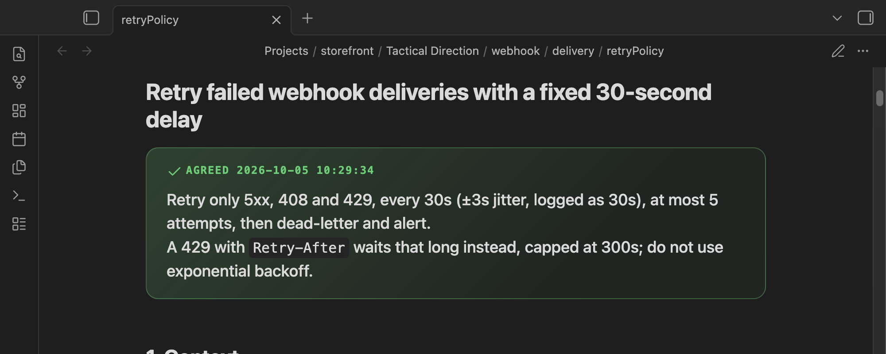

The installer has no dependencies, makes no network or model calls, and only edits one marked block in `AGENTS.md`.
The instructions are a plain prompt, not a skill or plugin, so any agent that reads `AGENTS.md` can follow them.

## Contents

- [How it works](#how-it-works)
- [Requirements](#requirements)
- [Quick start](#quick-start)
- [Install step by step](#install-step-by-step)
- [Install without prompts](#install-without-prompts)
- [What agents record](#what-agents-record)
- [What a note looks like](#what-a-note-looks-like)
- [Obsidian styling and dashboard](#obsidian-styling-and-dashboard)
- [Update, check and uninstall](#update-check-and-uninstall)
- [Troubleshooting](#troubleshooting)
- [Development](#development)

## How it works

1. **You run the installer once per project.**
It asks what to record and what to leave out, then adds a block between `<!-- BEGIN tactical-direction-context -->` and `<!-- END tactical-direction-context -->` to the project's `AGENTS.md`.
The block holds the rules for exactly the kinds you chose, and nothing for the ones you did not.
2. **Your agent reads `AGENTS.md` at the start of every session**, as Codex, Cursor and many other coding agents already do (for Claude Code, see [Requirements](#requirements)).
3. **When one of those moments happens, the agent writes or updates a note** in that kind's folder.
When the related work is finished, it links the note to its implementation summary.

Nothing runs in the background.
The installer writes text; the agent does the recording.

## Requirements

- Node.js 18 or newer.
- Git with access to this repository (it is private; Git handles the credentials, the installer never sees them).
- An agent that reads `AGENTS.md`.
Claude Code reads `CLAUDE.md` instead: make `AGENTS.md` a symlink to `CLAUDE.md` (`ln -s CLAUDE.md AGENTS.md`) before installing, or add the line `@AGENTS.md` to `CLAUDE.md`.
The installer follows a symlink as long as it stays inside the project.
- Obsidian is optional.
Notes are plain Markdown, but they are designed to look their best in Obsidian 1.9 or newer (the dashboard needs the core Bases plugin).

## Quick start

From the project you want agents to take notes for:

```sh
cd ~/code/storefront
npx --yes github:andyqioe/auto-note-taker
```

Pick the notes folder, tick what to record and what never to record, accept the styling if the folder is in an Obsidian vault, and confirm.
That is the whole setup.

## Install step by step

### 1. Start the wizard

Run the command above in a terminal.
The wizard starts whenever a terminal is attached and you did not pass both `--project` and `--notes-dir`.

Every screen works the same way:

| Key | Action |
|---|---|
| `↑` `↓` (or `j` `k`) | Move between options |
| `1` to `9` | Jump straight to an option |
| `Space` | Tick or untick, on the two checklists |
| `Enter` | Choose, or confirm a checklist |
| `Esc` | Go back one screen |
| `Ctrl+C` | Quit without changing anything |

### 2. Choose the project

The first screen offers **This folder** (the current directory, with a hint if it already has `AGENTS.md`, `CLAUDE.md` or `.git`), **Browse…**, or **Type a path…**.
The project is where `AGENTS.md` lives.

### 3. Choose the notes folder

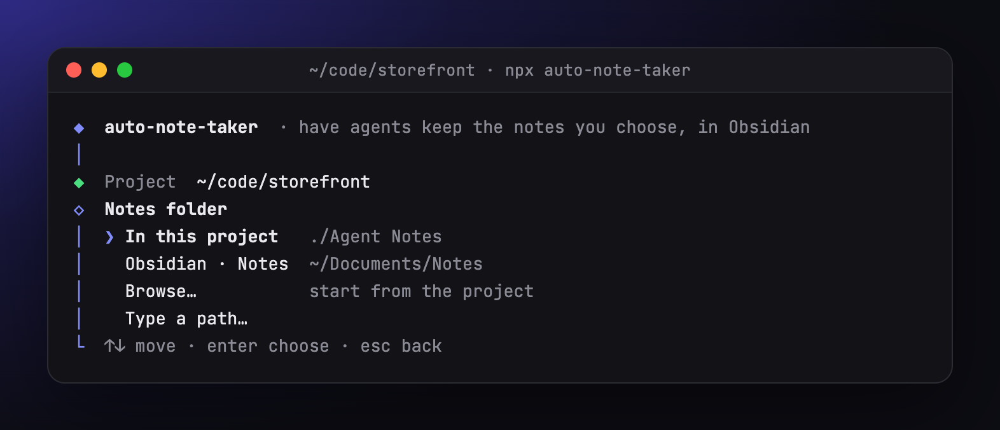

| Option | When to use it |
|---|---|
| **Keep current** | Shown when the project already has an install; keeps its folder. |
| **In this project** | Notes go to `./Agent Notes` inside the project and are committed with the code. |
| **Obsidian · *vault name*** | Opens the folder browser at the root of that vault. The wizard lists up to five vaults, most recently opened first, read from Obsidian's own vault list. |
| **Browse…** | Opens the folder browser at the project. |
| **Type a path…** | Type any path. `~` works, relative paths are relative to the project, and `Tab` completes folder names. |

A notes folder inside the project is recorded as a project-relative path, so the instructions keep working if the project moves or is cloned elsewhere.
A folder outside the project is recorded as an absolute path.

### 4. Browse to the folder

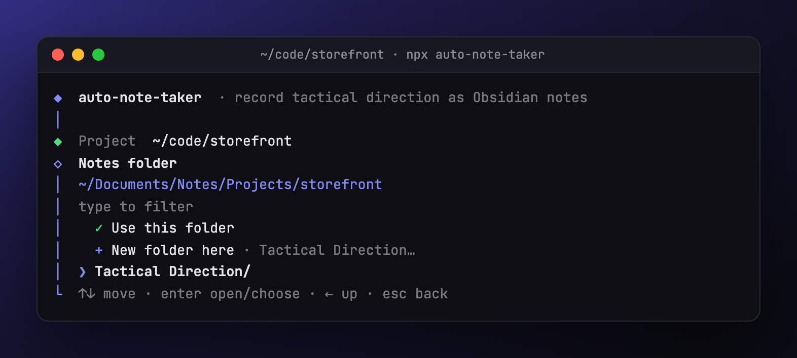

The browser shows the current folder at the top, then two actions, then the subfolders.

| Key | Action |
|---|---|
| `↑` `↓` | Move |
| `Enter`, `→` or `Tab` on a folder | Open it |
| `←`, or `Backspace` with an empty filter | Go up to the parent folder |
| Any letters | Filter the subfolders; `Enter` opens the highlighted match |
| `Esc` | Clear the filter, or go back if there is none |
| `Home` / `End` | Jump to the first or last row |

To choose, move to **✓ Use this folder** and press `Enter`.
The cursor always starts on the first subfolder, so pressing `Enter` repeatedly keeps opening folders and never chooses one by accident.

To start a fresh folder, choose **+ New folder here**, type a name (it defaults to `Agent Notes`), and press `Enter`.
The folder is not created now; the agent creates it with the first note.

A folder that contains `.obsidian/` is marked as an Obsidian vault.
Hidden folders, `node_modules` and `__pycache__` are not listed.

### 5. Choose what to record

A checklist of note kinds, one per line with a short hint.
Tick with `Space` and confirm with `Enter`; at least one kind is required.
**Pivots** and **Challenges & fixes** start ticked; on a re-run, the list starts from your last choice.
See [What agents record](#what-agents-record) for what each kind captures.

To record something the list does not cover, choose **+ Add your own kind…**, give it a name ("Perf wins") and finish the sentence "Record it when…" ("a change measurably sped something up").
It joins the list ticked, gets its own folder named after it, and agents follow your sentence as its definition.

### 6. Choose what never to record

The same kind of checklist, for moments agents must leave out even when they fit a kind you chose.
The first four start ticked:

| Exclusion | Leaves out |
|---|---|
| **Routine implementation steps** | What the diff, the commit message or an implementation summary already records |
| **Trivial fixes** | Typos, lint, formatting, and bugs fixed on the first try |
| **Agent mechanics** | Retries, tool errors, permission prompts, reruns |
| **Personal details** | Names, contact details, anything about people rather than the work (notes say "the reviewer" instead) |
| **Brainstorming not acted on** | Ideas floated and dropped without being tried |
| **What the repo already says** | Facts a reader gets from the code, its docs or its README |

**+ Add your own rule…** adds a line in your words, such as "anything about the CI provider".
Secrets are always redacted, whatever you tick.

### 7. Decide on styling

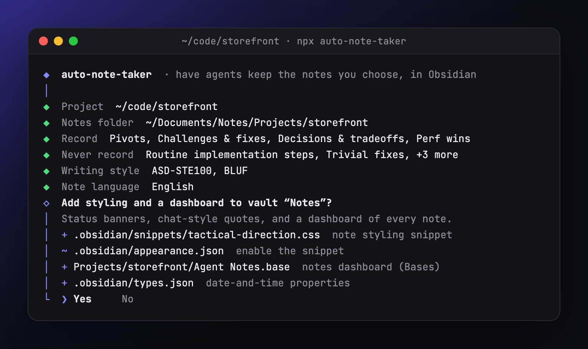

If the notes folder is inside an Obsidian vault, the wizard offers to add a styling snippet and a dashboard, and lists every file it would add (`+`) or change (`~`).
See [Obsidian styling and dashboard](#obsidian-styling-and-dashboard) for what they do.
Choose **No** to keep the vault untouched; notes still render with stock Obsidian colors.

### 8. Confirm

The last screen shows the instructions file, whether the block will be created, added or updated, the notes folder, the kinds to record with their folders, and what will never be recorded.
Nothing is written before you choose **Yes**.
`Esc` goes back a step at a time, keeping what you ticked.

### 9. Done

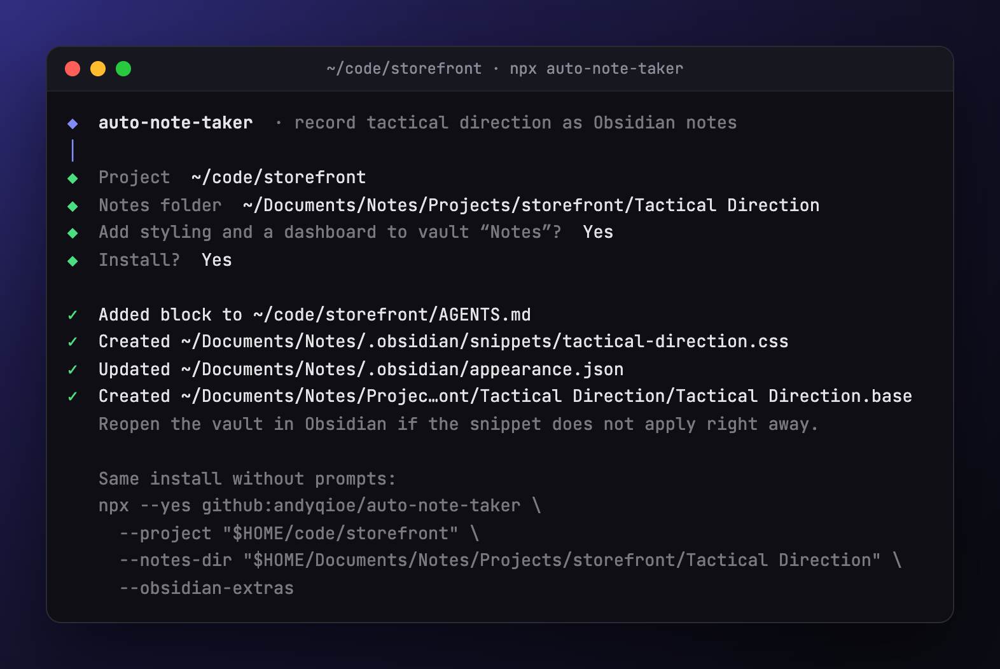

The wizard lists every file it wrote and prints the same install as a command, with your kinds and exclusions as flags, that you can paste into a script, a README or another machine.
Paths under your home folder print as `"$HOME/…"` so the command works for teammates too.

## Install without prompts

Pass both paths, or add `--yes` to accept defaults for anything missing.
Without `--record` and `--skip`, a project keeps the choice it made last time (a first install uses the defaults).
The installer also never prompts when stdin or stdout is not a terminal (CI, pipes) or with `--check`.

```sh
# Notes inside the project, recording the defaults (pivots and challenges)
npx --yes github:andyqioe/auto-note-taker --project . --yes

# Notes in a vault, with your own choice of kinds and exclusions, plus the styling and dashboard
npx --yes github:andyqioe/auto-note-taker \
  --project ~/code/storefront \
  --notes-dir "$HOME/Documents/Notes/Projects/storefront" \
  --record tactical-direction,pivots,challenges,decisions \
  --add-kind 'Perf wins=a change measurably sped something up' \
  --skip routine,trivial-fixes,agent-mechanics,personal \
  --add-skip 'anything about the CI provider' \
  --obsidian-extras

# Pin a reviewed commit for reproducible installs
npx --yes github:andyqioe/auto-note-taker#COMMIT_SHA --project . --yes
```

| Flag | Meaning |
|---|---|
| `--project PATH` | Project whose `AGENTS.md` receives the block. Default: the current directory. |
| `--notes-dir PATH` | Where notes go, one subfolder per kind. Relative paths are inside the project. Default: the folder from the last install, else `Agent Notes`. Must be one line without backticks. |
| `--record KINDS` | Comma-separated kinds to record: `tactical-direction`, `pivots`, `challenges`, `decisions`, `dead-ends`, `gotchas`, `open-questions`. Replaces the previous choice, including kinds you added. Default: the last choice, else `pivots,challenges`. |
| `--add-kind "NAME=WHEN"` | Also record a kind of your own; repeat for several. On its own it extends the previous choice. |
| `--skip ITEMS` | Comma-separated things never to record, or `none`: `routine`, `trivial-fixes`, `agent-mechanics`, `personal`, `brainstorm`, `restated-docs`. Default: the last choice, else the first four. |
| `--add-skip TEXT` | Also never record this, in your words; repeat for several. |
| `--obsidian-extras` | Also install the styling snippet and dashboard, if the notes folder is inside a vault. |
| `--no-obsidian-extras` | Never offer or install them. |
| `--yes`, `-y` | Do not prompt; use defaults for anything not given. |
| `--check` | Report whether the block is current, without writing. |
| `--help`, `-h` | Print usage. |

Exit codes: `0` on success (and for `--check` when the block is current), `1` on an error or an out-of-date `--check`, `130` when you quit the wizard with `Ctrl+C`.

## What agents record

The block lists the kinds you chose, each with its own folder, tag and sections, and agents record only those.
When a moment fits a kind but also matches something you excluded, the exclusion wins.
When a topic already has a note, the agent updates it instead of starting another.

| Kind | Folder and tag | Recorded when | Sections |
|---|---|---|---|
| **Tactical direction** | `Tactical Direction/`, `tactical-direction` | You reject or reshape a proposal, set a working rule ("use pnpm, never npm"), or leave a question open | Context, Agent Proposal, User Disagreement (with the verbatim exchange), Reconciliation, Final agreement |
| **Pivots** | `Pivots/`, `pivot` | The approach of record changes partway through, whoever started it | Before, Trigger, After, Why, Impact |
| **Challenges & fixes** | `Challenges/`, `challenge` | A problem took real effort: a non-obvious bug, several attempts, a tooling obstacle | Symptom, Root cause, What was tried, Fix, Why this fix, Verification |
| **Decisions & tradeoffs** | `Decisions/`, `decision` | The agent chose between real alternatives on its own judgment | Context, Options, Choice, Why, Consequences |
| **Dead ends** | `Dead Ends/`, `dead-end` | An approach was tried for real and abandoned | Goal, Approach, Why it failed, Conditions, What replaced it |
| **Gotchas & lessons** | `Gotchas/`, `gotcha` | A tool, library or this codebase behaved in a surprising way worth remembering | Gotcha, Example, Do instead, Source |
| **Open questions & assumptions** | `Open Questions/`, `open-question` | Work goes ahead on an unconfirmed assumption, or a question only someone else can settle | Question, Current assumption, Why it matters, Who decides, Answer |
| *Your own kind* | a folder named after it, a tag made from its name | Your "Record it when…" sentence | Context, What happened, Why it matters, Follow-ups |

Notes link to each other where one led to another: a dead end to the pivot it caused, a challenge to the decision it forced.

Every note, whatever its kind, follows these rules:

- **Filename:** `[Category]-[Sub-category]-[Sub-sub-category].md`, for example `proxy-session-stateHandling.md`.
- **Sections:** the kind's sections, in order. A section with nothing to say says so in one line; agents must not invent content.
- **Your words:** when your message triggered or decided what a note records, it is quoted word for word in a fenced `text` block. Tactical-direction notes keep the whole exchange, labelled User and Agent, in order.
A message that itself contains a code block gets a longer fence, so it cannot break the note.
- **Secrets:** API keys and passwords are replaced with `[REDACTED: <kind>]` before anything is written.
- **Evidence:** user requirements and assumptions are labelled separately from measurements and test results.
- **Status:** each kind has its own small vocabulary, such as `agreed` / `pending` / `superseded` for tactical direction, `resolved` / `workaround` / `open` for challenges, or `open` / `answered` / `obsolete` for open questions.
- **Implementation link:** once the work is done, the note links the saved `implementation-summary` artifact (Markdown, plus the HTML companion when there is one) and its status is updated.
An agent never claims something is implemented or verified before it is.

## What a note looks like

The layout uses only core Obsidian features, so it reads well without any plugins.
The screenshots show a tactical-direction note; every other kind shares the same properties, banner and callout colors with its own sections.

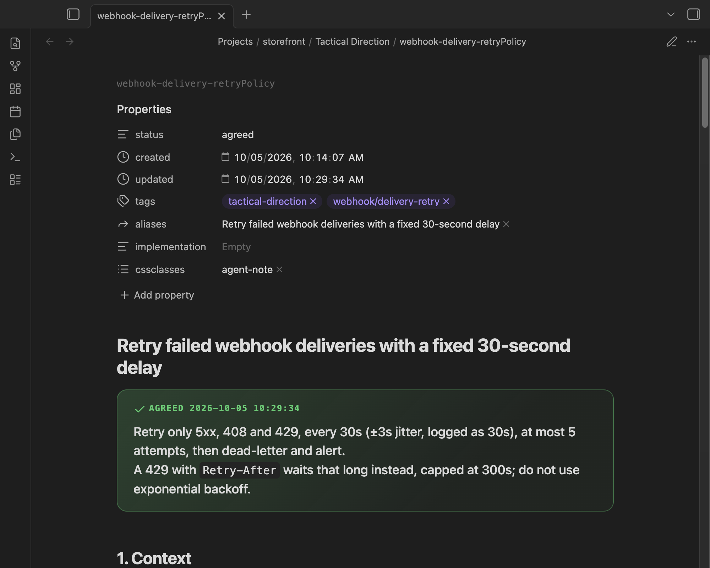

**Properties.** Exactly seven, so the banner stays near the top:

```yaml
---
status: agreed                 # the kind's own vocabulary, here agreed | pending | superseded
created: 2026-10-05
updated: 2026-10-05
tags: [tactical-direction, webhook/delivery]
aliases: ["Retry failed webhook deliveries with a fixed 30-second delay"]
implementation:                # the implementation-summary link, once it exists
cssclasses: [agent-note]
---
```

The kind's tag (here `tactical-direction`) is what the dashboard queries, and the nested tag groups notes by area in Obsidian's tag pane.
The alias repeats the title in quotes, because an unquoted comma would split it into several aliases.

**Title and banner.** The heading is a decision a person would search for, not the filename.
Directly under it, a callout states the binding rule in one or two sentences, colored by status: green for agreed, amber for pending, red for superseded.
A pending banner also says what is undecided and who decides it:

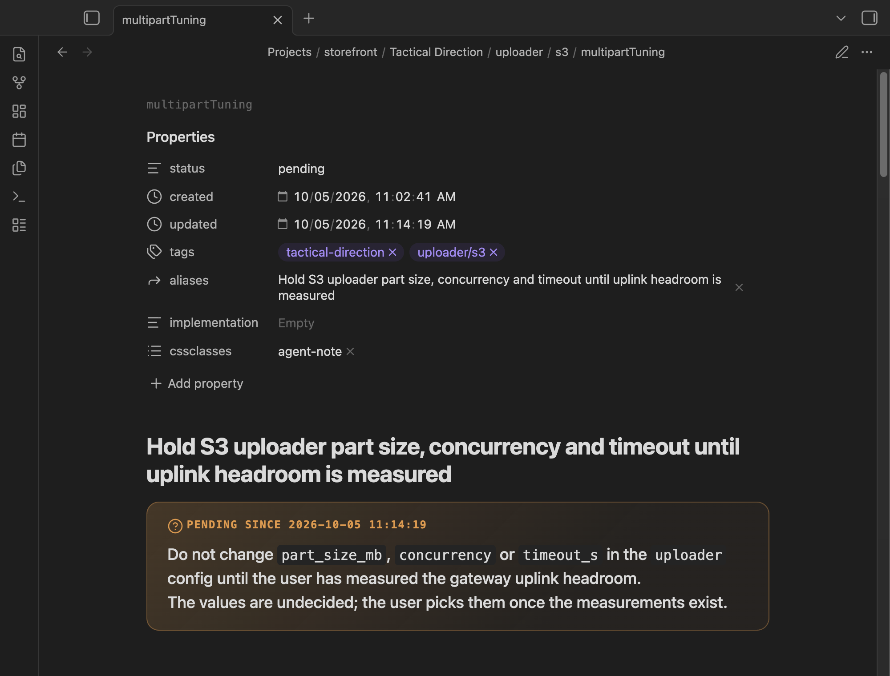

**Colors with one job each.**

| Callout | Used for |
|---|---|
| `abstract` (teal) | What the agent proposed, or the approach before a pivot |
| `warning` (orange) | What you changed or rejected, and caveats |
| `success` (green) | The agreed rules, and what now holds |
| `failure` (red) | What was abandoned |
| `todo` (blue) | Open follow-ups the conversation did not settle |
| `quote` | Each verbatim message |

Everything else stays plain prose, tables and lists, so the colored blocks keep their meaning.

**The exchange, as a chat.**
Your messages and the agent's replies sit under `### Exchange (verbatim)`, newest last, with long agent replies folded.

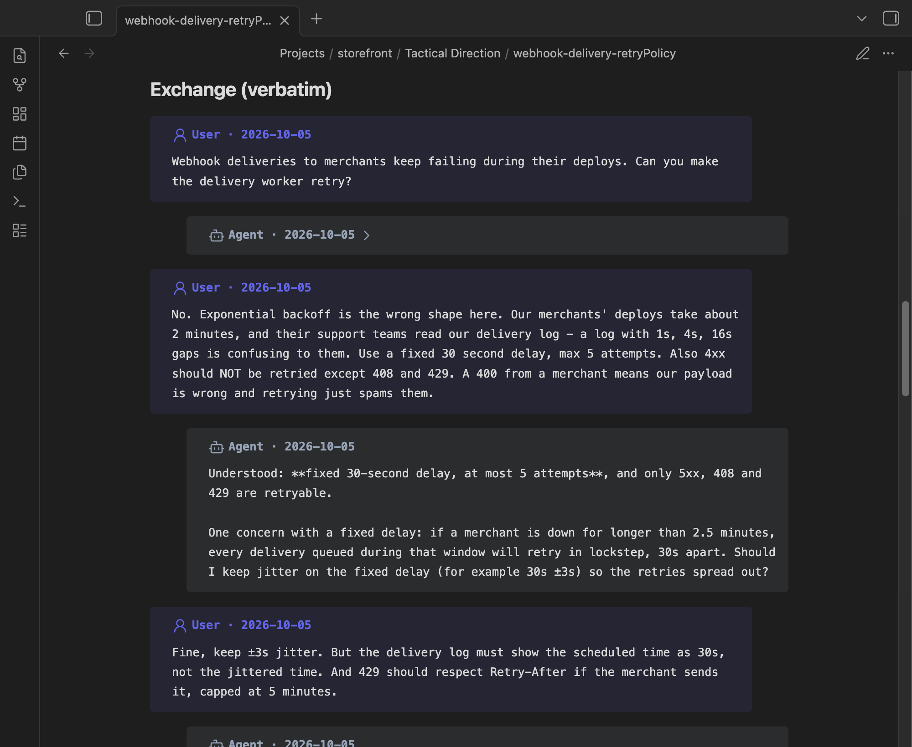

**Reconciliation and agreement.**
When several points changed, `4. Reconciliation` uses a table of what was proposed, what it became, and why.
`5. Final agreement` numbers each rule so a future agent can check its work against it.
A small `mermaid` diagram appears only when the agreement is a flow or a state machine.

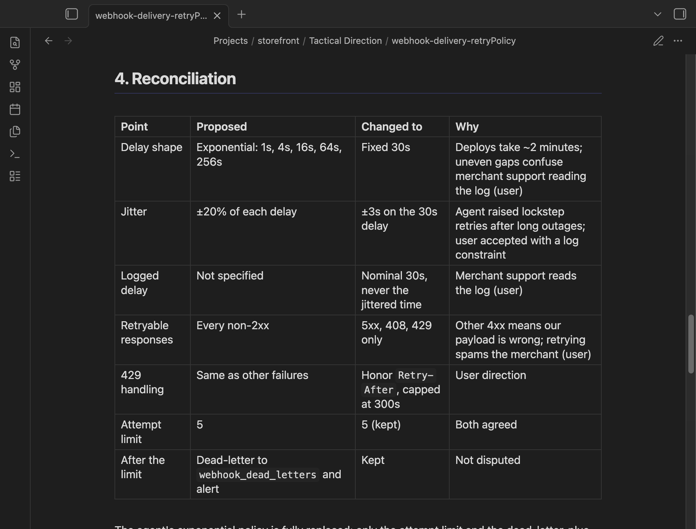

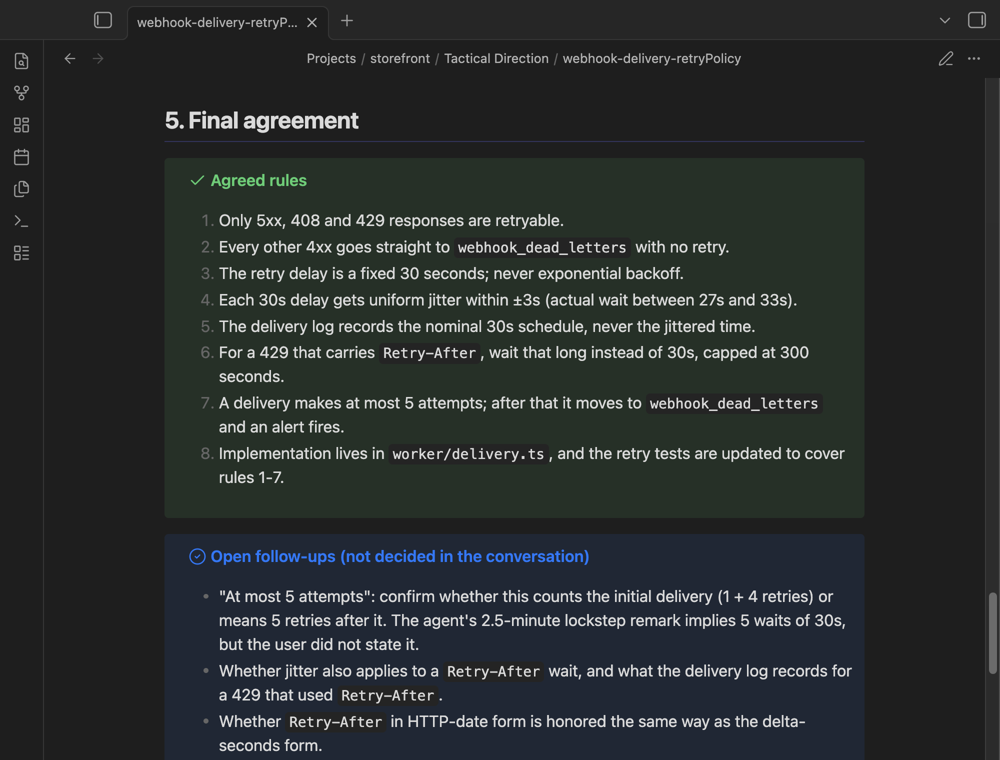

**Writing.** Present tense, short sentences, one idea per bullet, your own terms for project concepts, and prose in the language you write in.

## Obsidian styling and dashboard

When the notes folder is inside a vault, the installer can add two files (the wizard asks; scripts pass `--obsidian-extras`).

**`.obsidian/snippets/tactical-direction.css`**, enabled by adding `tactical-direction` to `enabledCssSnippets` in `.obsidian/appearance.json` (your other settings are kept).
It only affects notes with `cssclasses: [agent-note]` (or `[tactical-direction]`, from earlier versions), and it:

- turns the status callout into a large banner;
- shows the filename above the title as a small slug;
- underlines the numbered sections;
- styles the exchange as a chat, with user messages in indigo and agent messages in slate, each with an icon;
- shrinks wide diagrams to fit the page.

Without the snippet, every element falls back to a stock Obsidian callout, so notes stay readable.
To turn it on or off by hand: **Settings → Appearance → CSS snippets → tactical-direction**.

**`Agent Notes.base`** in the notes folder: a dashboard of every note of the kinds you record.
**All by kind** groups every note by its folder, newest first; then one view per kind groups its notes by status; **Open** lists everything still waiting on someone (pending direction, open challenges and questions, proposed decisions, dead ends to revisit).
It is rebuilt when you change what you record.

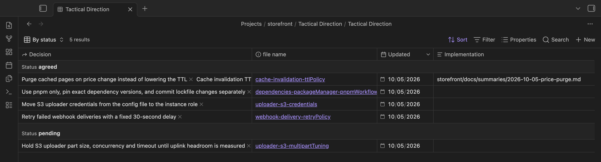

The installer never overwrites your changes.
It updates the snippet only while its first line still reads `auto-note-taker: managed snippet`; delete that line to make the file yours.
It updates the dashboard only while its first line still reads `auto-note-taker: managed dashboard` (same rule), and it leaves `appearance.json` alone if the file is not valid JSON.

## Update, check and uninstall

**Update.** Run the installer again.
It replaces only its own block, so other text in `AGENTS.md` is untouched, and a run with nothing new to write changes no bytes.
The block stores your choices on one line, so the wizard starts from them (**Keep current** for the folder, your ticks on both checklists) and a run without flags keeps them.

**Upgrading from a version without note kinds.** An earlier block is read as "record tactical direction, straight into the notes folder", so a plain re-run keeps recording exactly what it did, and existing notes stay where they are.
Tick more kinds to add them: each new kind gets a subfolder of the existing notes folder.
The old `Tactical Direction.base` dashboard is left as it was; the new one is `Agent Notes.base`.

**Check.** `--check` exits `0` when the block matches this version and `1` when it is missing or out of date, without writing anything.
Use it in CI to catch projects that need a refresh:

```sh
npx --yes github:andyqioe/auto-note-taker --project . --check
```

**Uninstall.** Delete everything from `<!-- BEGIN tactical-direction-context -->` to `<!-- END tactical-direction-context -->` in `AGENTS.md`.
Your notes stay where they are.
If you added the styling, also delete `.obsidian/snippets/tactical-direction.css` and the `Agent Notes.base` file.

## Troubleshooting

| Symptom | Fix |
|---|---|
| `npx` cannot fetch the package | The repository is private. Check that `git ls-remote https://github.com/andyqioe/auto-note-taker` works for your account. |
| The wizard did not start | It only runs in a terminal with a path missing. Without a terminal, or with `--yes`, `--check` or both paths, it installs directly. |
| A vault is missing from the list | The wizard lists vaults Obsidian has opened on this machine, five at most. Choose **Browse…** or **Type a path…** instead. |
| The note looks plain in Obsidian | Check that the snippet is enabled in **Settings → Appearance → CSS snippets**, and that the note has `cssclasses: [agent-note]`. Reopen the vault if you installed while Obsidian was running. |
| The dashboard shows nothing | Bases needs Obsidian 1.9 or newer with the core Bases plugin on, and notes need their kind's tag (`pivot`, `challenge`, ...). |
| An agent records something you excluded, or skips a kind you chose | Run the installer again and check both checklists; `--check` tells you whether the block is current. For your own kinds and rules, a more concrete sentence helps ("a change with before and after timings" rather than "performance stuff"). |
| `unknown note kind` or `unknown exclusion` | A typo in `--record` or `--skip`. The error lists the valid names. |
| `AGENTS.md points outside the project` | `AGENTS.md` is a symlink to another project. Install in the project that owns the file. |
| `Malformed or duplicate managed block` | `AGENTS.md` has a `BEGIN` marker without its `END`, or two blocks. Fix the markers by hand; the installer changes nothing until then. |
| `Project instructions changed during installation` | Something else edited `AGENTS.md` at the same moment. Run again. |

## Development

```text
bin/install.mjs                      command-line flags and the wizard
lib/install.mjs                      renders, plans and writes the managed block, and reads back its saved choice
lib/kinds.mjs                        the note kinds and exclusions, and selection validation
lib/obsidian.mjs                     vault discovery, snippet, and the dashboard generated from the chosen kinds
lib/ui.mjs                           dependency-free terminal prompts, including the checklist
context/AGENTS.md                    the shared instructions that get installed
context/kinds/                       one file of instructions per note kind (custom.md for your own)
context/obsidian/                    the styling snippet
test/                                node:test suites
```

Everything runs offline from a clone:

```sh
node bin/install.mjs --project /path/to/project --notes-dir 'Agent Notes' --record pivots,challenges
node bin/install.mjs --project /path/to/project --check
npm test
```

Each prompt in `lib/ui.mjs` is a pure state machine (an initial state, a key handler and a render), so the tests drive it without a terminal.

For a portable package, run `npm pack` and install the `.tgz` with `npx --package ./auto-note-taker-<version>.tgz auto-note-taker`.
No npm registry release is published; installing from GitHub does not need one.
