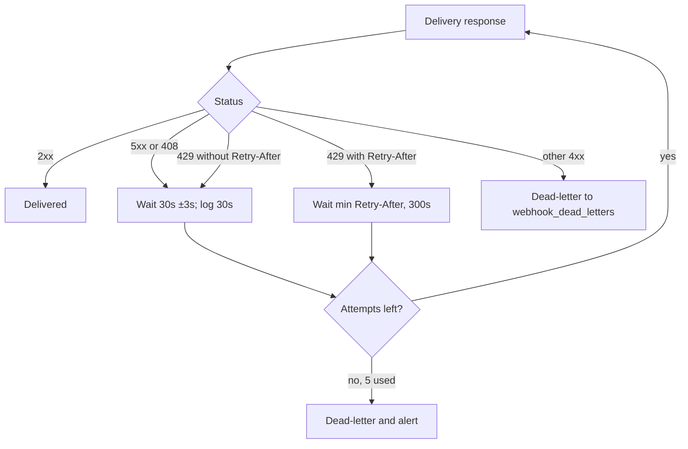

# Retry failed webhook deliveries with a fixed 30-second delay

> [!success|banner] Agreed 2026-10-05 10:29:34
> Retry only 5xx, 408 and 429, every 30s (±3s jitter, logged as 30s), at most 5 attempts, then dead-letter and alert.
> A 429 with `Retry-After` waits that long instead, capped at 300s; do not use exponential backoff.

## 1. Context

- Project: `billing-worker`.
- Problem: webhook deliveries to merchants fail while the merchant is deploying.
- Ask: make the delivery worker retry failed deliveries.
- Code in scope: `worker/delivery.ts` and its retry tests.
- User-stated operating assumptions (not measured by the agent):
  - Merchant deploys take about 2 minutes.
  - Merchant support teams read our delivery log, so the logged retry schedule must be easy for them to follow.
  - A 400 from a merchant means our payload is wrong; retrying it only spams the merchant.

## 2. Agent Proposal

> [!abstract] Proposed
> - Exponential backoff with ±20% jitter: 1s, 4s, 16s, 64s, 256s.
> - After attempt 5, move the delivery to `webhook_dead_letters` and fire an alert.
> - Treat every non-2xx response as retryable.

The agent's reason: immediate retries would hammer merchants mid-deploy, and jitter keeps retries from many deliveries from lining up.

## 3. User Disagreement

> [!warning] User direction
> - Reject exponential backoff: it is the wrong shape for ~2-minute deploys, and 1s/4s/16s gaps confuse merchant support teams reading the delivery log.
> - Use a fixed 30-second delay, max 5 attempts.
> - Do not retry 4xx, except 408 and 429.
> - Jitter of ±3s is acceptable only if the delivery log shows the scheduled 30s, not the jittered time.
> - For 429, respect `Retry-After` when the merchant sends it, capped at 5 minutes.

### Exchange (verbatim)

> [!quote|user] User · 2026-10-05 10:14:07
> ```text
> Webhook deliveries to merchants keep failing during their deploys. Can you make the delivery worker retry?
> ```

> [!quote|agent]- Agent · 2026-10-05 10:15:30
> ```text
> **I'd add exponential backoff with jitter to the delivery worker.** Retrying immediately would hammer merchants who are mid-deploy.
>
> Proposed policy:
>
> | Attempt | Delay |
> |---|---|
> | 1 | 1s |
> | 2 | 4s |
> | 3 | 16s |
> | 4 | 64s |
> | 5 | 256s |
>
> Each delay gets ±20% jitter so retries from many deliveries don't line up. After attempt 5 the delivery moves to the dead-letter table (`webhook_dead_letters`) and an alert fires.
>
> I'd also make the worker treat every non-2xx response as retryable, since merchants return all kinds of codes during deploys.
> ```

> [!quote|user] User · 2026-10-05 10:17:51
> ```text
> No. Exponential backoff is the wrong shape here. Our merchants' deploys take about 2 minutes, and their support teams read our delivery log - a log with 1s, 4s, 16s gaps is confusing to them. Use a fixed 30 second delay, max 5 attempts. Also 4xx should NOT be retried except 408 and 429. A 400 from a merchant means our payload is wrong and retrying just spams them.
> ```

> [!quote|agent] Agent · 2026-10-05 10:18:48
> ```text
> Understood: **fixed 30-second delay, at most 5 attempts**, and only 5xx, 408 and 429 are retryable.
>
> One concern with a fixed delay: if a merchant is down for longer than 2.5 minutes, every delivery queued during that window will retry in lockstep, 30s apart. Should I keep jitter on the fixed delay (for example 30s ±3s) so the retries spread out?
> ```

> [!quote|user] User · 2026-10-05 10:22:14
> ```text
> Fine, keep ±3s jitter. But the delivery log must show the scheduled time as 30s, not the jittered time. And 429 should respect Retry-After if the merchant sends it, capped at 5 minutes.
> ```

> [!quote|agent] Agent · 2026-10-05 10:22:52
> ```text
> Agreed. Final policy:
>
> 1. Retry 5xx, 408 and 429 only. Every other 4xx goes straight to `webhook_dead_letters`.
> 2. Fixed 30-second delay with ±3s jitter; the delivery log records the nominal 30s schedule.
> 3. For 429 with `Retry-After`, wait that long instead, capped at 300 seconds.
> 4. At most 5 attempts, then dead-letter and alert.
>
> I'll implement this in `worker/delivery.ts` and update the retry tests.
> ```

> [!quote|user] User · 2026-10-05 10:24:51
> ```text
> Good. Go.
> ```

## 4. Reconciliation

| Point | Proposed | Changed to | Why |
|---|---|---|---|
| Delay shape | Exponential: 1s, 4s, 16s, 64s, 256s | Fixed 30s | Deploys take ~2 minutes; uneven gaps confuse merchant support reading the log (user) |
| Jitter | ±20% of each delay | ±3s on the 30s delay | Agent raised lockstep retries after long outages; user accepted with a log constraint |
| Logged delay | Not specified | Nominal 30s, never the jittered time | Merchant support reads the log (user) |
| Retryable responses | Every non-2xx | 5xx, 408, 429 only | Other 4xx means our payload is wrong; retrying spams the merchant (user) |
| 429 handling | Same as other failures | Honor `Retry-After`, capped at 300s | User direction |
| Attempt limit | 5 | 5 (kept) | Both agreed |
| After the limit | Dead-letter to `webhook_dead_letters` and alert | Kept | Not disputed |

The agent's exponential policy is fully replaced; only the attempt limit and the dead-letter-plus-alert terminal step survive from the proposal.



## 5. Final agreement

> [!success] Agreed rules
> 1. Only 5xx, 408 and 429 responses are retryable.
> 2. Every other 4xx goes straight to `webhook_dead_letters` with no retry.
> 3. The retry delay is a fixed 30 seconds; never exponential backoff.
> 4. Each 30s delay gets uniform jitter within ±3s (actual wait between 27s and 33s).
> 5. The delivery log records the nominal 30s schedule, never the jittered time.
> 6. For a 429 that carries `Retry-After`, wait that long instead of 30s, capped at 300 seconds.
> 7. A delivery makes at most 5 attempts; after that it moves to `webhook_dead_letters` and an alert fires.
> 8. Implementation lives in `worker/delivery.ts`, and the retry tests are updated to cover rules 1-7.

> [!todo] Open follow-ups (not decided in the conversation)
> - "At most 5 attempts": confirm whether this counts the initial delivery (1 + 4 retries) or means 5 retries after it. The agent's 2.5-minute lockstep remark implies 5 waits of 30s, but the user did not state it.
> - Whether jitter also applies to a `Retry-After` wait, and what the delivery log records for a 429 that used `Retry-After`.
> - Whether `Retry-After` in HTTP-date form is honored the same way as the delta-seconds form.
> - Whether the alert also fires for non-retryable 4xx dead-letters, or only when retries are exhausted.

### Implementation

Status: not started as of 2026-10-05.
The user approved the policy ("Good. Go."); no code change or test has been made or verified yet.
Add the `$implementation-summary` link here and in the `implementation` property once `worker/delivery.ts` and the retry tests land.
